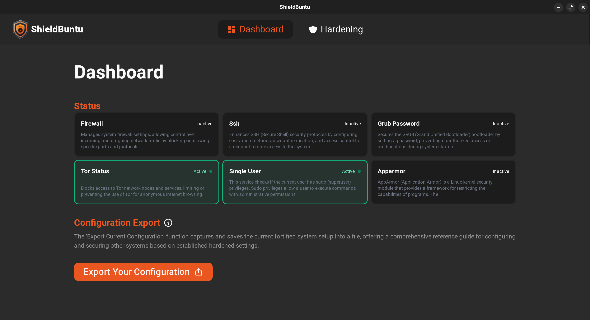
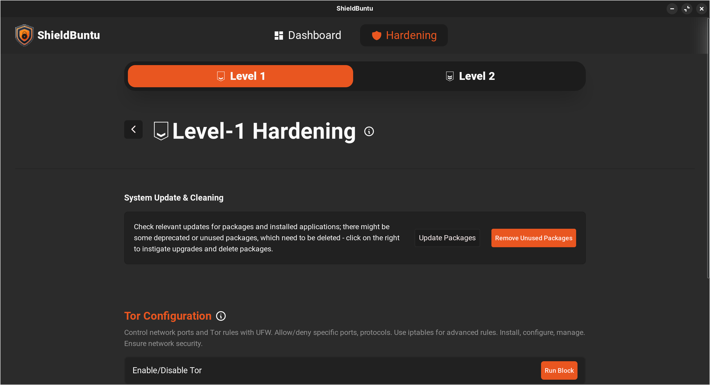
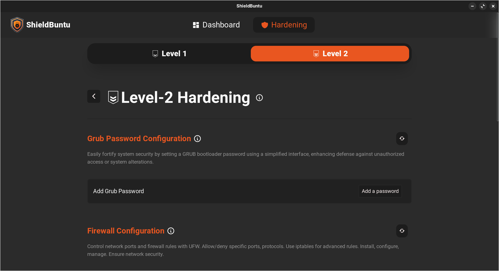

# Shieldbuntu

Shieldbuntu is a collection of scripts designed to enhance the security of Ubuntu and Ubuntu-based distributions. These scripts implement various hardening features to protect your system from attacks, malwares, and potential vulnerabilities.

## Features

1. **AppArmor**
   - Configure AppArmor profiles for enhanced application security.

2. **SSH Hardening**
   - Strengthen SSH configuration for improved access control.

3. **Kernel Hardening**
   - Implement kernel-level security measures.

4. **Tor Blocking**
   - Block Tor network to enhance network security.

5. **Antivirus Installation**
   - Install antivirus software for added protection.

6. **Enable Auditing**
   - Enable system auditing for monitoring and analysis.

7. **Fail2Ban**
   - Set up Fail2Ban to protect against brute-force attacks.

8. **Grub Secure**
   - Secure Grub bootloader configuration.

9. **USB Blocking**
   - Restrict USB access for increased security.

10. **Firewall Setup**
    - Configure a firewall to control incoming and outgoing traffic.

... and many more, all customizable based on user preferences. The hardening features are divided in couple levels, as mentioned in CIS Benchmarks. 

## Tauri Framework + React + Rust

Shieldbuntu leverages the lightweight Tauri framework, combining the flexibility of React for the GUI and the security of Rust for the backend.

## Screenshots

Include some screenshots here to showcase the user interface or demonstrate the effects of Shieldbuntu in action.








## Installation

### Prerequisites

Make sure to fulfill all prerequisites listed in the [Tauri Documentation](https://tauri.app/v1/guides/getting-started/prerequisites).

### Clone Repository and Install Dependencies

```bash
git clone https://github.com/samrakshak23/shieldbuntu.git
cd shieldbuntu
npm install
```

### Install Rust

```bash
curl --proto '=https' --tlsv1.2 -sSf https://sh.rustup.rs | sh
```

### Start Development Server
```bash
npm run tauri dev
```

## Usage 
Shieldbuntu can be used to harden both local and remote Ubuntu machines via SSH.


## Contributors

[Akshat Pandey](https://www.linkedin.com/in/akshat-pandey-001a53147) <br>
[Jayash Tripathi](https://github.com/JayashTripathy)<br>
[Vaibhav Shukla](https://github.com/mvaibhav77)<br>
[Shashwat Gupta](https://github.com/Shashwat79802)<br>
[Shashank Yadav](https://github.com/Shanks2121)<br>
[Poorva Diwan](https://github.com/poorvadiwan)<br>
[Sanskriti Harmukh](https://github.com/SanskritiHarmukh) <br>

## Contribution
Feel free to contribute by opening issues, proposing new features, or submitting pull requests. We welcome your feedback and collaboration.

Happy hardening!